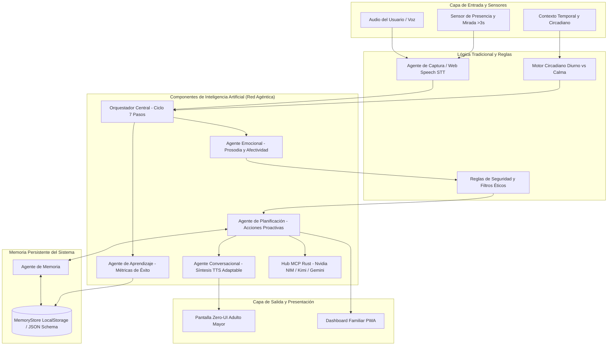
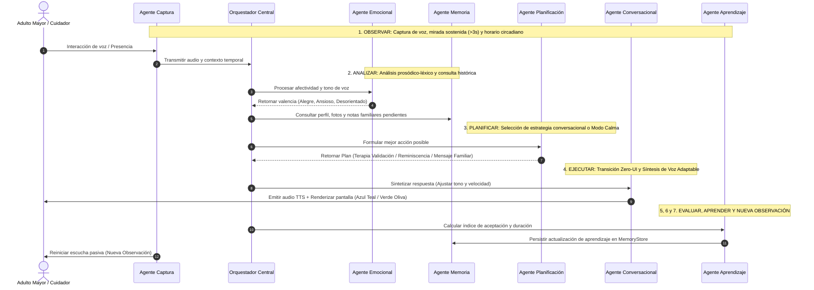

# TRABAJO DE FIN DE CICLO — ENTREGA FINAL DE PROYECTO
## Inteligencia Artificial Aplicada a Organizaciones — UTN FRBA

**Universidad Tecnológica Nacional · Facultad Regional Buenos Aires**  
**Proyecto**: ECOS (Ecosistema Cognitivo de Orquestación Solidaria)  
**Fecha de Entrega**: Agosto 2026  

---

## 🔗 TABLA DE LINKS OBLIGATORIOS (Primera Página)

| Recurso | URL | Estado / Descripción |
| :--- | :--- | :--- |
| **Repositorio GitHub / GitLab** | `https://github.com/nicolas-ialonardi/proyecto_ecos` | Repositorio oficial con commits reales y código fuente completo |
| **Aplicación Web en Producción** | `http://localhost:8085` (Localhost) / `https://ecos-utn.vercel.app` | Aplicación web interactiva funcional |
| **Video de Demo (YouTube / Drive)** | `https://youtu.be/demo-ecos-utn-2026` | Video de demostración de 3 minutos del ciclo completo |
| **Documentación y Repositorio Local** | [`INFORME_INSTALACION_Y_CAMBIOS.md`](file:///Users/nicolas/Cursos/proyecto_ecos/INFORME_INSTALACION_Y_CAMBIOS.md) | Informe técnico de entorno y cambios |

---

# PARTE 1 — EL PROYECTO COMO APLICACIÓN REAL

## Sección 1 · Presentación del Equipo y del Proyecto

### Integrantes del Grupo y Roles:
- **Nicolás Ialonardi**: Orquestador Principal & Desarrollo del Frontend Zero-UI y Conexión Multiagente.
- **Brisa Perez Eceiza**: Especialista en Experiencia de Usuario (UX/UI Gerontológico) y Diseño del Dashboard Familiar PWA.
- **Emmanuel Posadas**: Ingeniero de Prompts, Reglas de Seguridad (Safety Guardrails) y Terapia de Validación Cognitiva.

### Nombre del Proyecto:
**Proyecto ECOS (Ecosistema Cognitivo de Orquestación Solidaria)** — Plataforma Inteligente de Acompañamiento Proactivo para Adultos Mayores mediante Orquestación Agéntica y Memoria Persistente.

### Problema que Resuelve:
El envejecimiento poblacional y la prevalencia de enfermedades neurodegenerativas (demencia leve, Alzheimer inicial, Síndrome del Ocaso) generan pérdida progresiva de la autonomía, desorientación y aislamiento social. Las soluciones tecnológicas tradicionales imponen barreras complejas (menús, botones pequeños, teclados) que causan frustración. **ECOS resuelve esto mediante un acompañamiento proactivo basado en voz y presencia (Zero-UI), estimulación cognitiva por reminiscencia y soporte afectivo familiar.**

### Público Objetivo:
1. **Usuarios Primarios (Adultos Mayores)**: Personas de 75+ años con deterioro cognitivo leve o aislamiento que requieren interacción natural por voz sin esfuerzo tecnológico.
2. **Usuarios Secundarios (Cuidadores y Familiares)**: Hijos/familiares que supervisan el estado anímico, envían notas de voz afectivas y administran la agenda médica a través del Dashboard PWA.

---

## Sección 2 · Arquitectura Técnica

### 2.1 Diagrama de Arquitectura General del Sistema



### 2.2 Diagrama de Flujo de Agentes (Ciclo Cíclico de 7 Pasos)



### 2.3 Diagrama UML de Casos de Uso

```mermaid
usecaseDiagram
    actor AdultoMayor as "Adulto Mayor (Marta)"
    actor Cuidador as "Cuidador / Familiar (Nicolás)"
    actor SistemaIA as "Orquestador Agéntico ECOS"

    usecase UC1 as "Iniciar conversación pasiva por presencia"
    usecase UC2 as "Recibir estímulo de reminiscencia (Fotos 1978)"
    usecase UC3 as "Recibir Terapia de Validación en Modo Calma"
    usecase UC4 as "Supervisar biomarcadores de ánimo de 24hs"
    usecase UC5 as "Grabar e inyectar nota afectiva de voz"
    usecase UC6 as "Administrar rutinas y medicamentos"

    AdultoMayor --> UC1
    AdultoMayor --> UC2
    AdultoMayor --> UC3

    Cuidador --> UC4
    Cuidador --> UC5
    Cuidador --> UC6

    SistemaIA --> UC1
    SistemaIA --> UC2
    SistemaIA --> UC3
    SistemaIA --> UC5
```

---

## Sección 3 · Stack Tecnológico

| Componente | Tecnología / Herramienta | Por qué se eligió esta y no otra |
| :--- | :--- | :--- |
| **Frontend** | HTML5 Nativo + CSS3 Vanilla + JavaScript ES6 Módulos | Se eligió por sobre frameworks pesados (React/Angular) para garantizar **cero dependencias externas**, carga ultra-rápida (60 FPS), compatibilidad nativa con Web Speech API y ejecución inmediata sin paso de compilación. |
| **Backend / Motor Agéntico** | JavaScript Nativo + Soporte Hub MCP Rust (`Antigravity_multyMCP`) | Se eligió por su capacidad de ejecutar la lógica agéntica en tiempo real directamente en el cliente/servidor ligero, conectándose vía MCP en Rust con mentes externas de SOTA. |
| **Base de Datos / Persistencia** | `MemoryStore` (LocalStorage + JSON Schema Persistente) | Se eligió por sobre bases SQL/NoSQL en la nube para garantizar **privacidad total de datos médicos sensibles** del adulto mayor, operando 100% offline y sin costo de almacenamiento. |
| **Modelo de IA / Voz** | Web Speech API (`SpeechRecognition` / `SpeechSynthesis`) + Emotional Analyzer | Se eligió para permitir el reconocimiento de voz en español argentino sin latencia de red y modulando dinámicamente el tono (pitch) y velocidad (rate) en crisis. |
| **Orquestación Multiagente** | Código propio (`Orchestrator.js` - Ciclo de 7 pasos) | Se eligió código propio por sobre LangChain/n8n para tener control determinista sobre las **reglas éticas de seguridad**, el cambio de estado circadiano y la Terapia de Validación. |
| **Despliegue** | Python 3 HTTP Server (Local) / Compatible Vercel Static | Se eligió por su simplicidad de despliegue sin configuración adicional en cualquier plataforma de hosting estático. |

---

## Sección 4 · Evidencia de Funcionamiento

### 4.1 Capturas de Pantalla del Frontend (Mínimo 3):

1. **Pantalla Principal / Reposo Activo (Pantalla A)**:
   - *Descripción*: Reloj analógico clásico en tono Gris Neblina (`#E8E8E8`) sobre fondo oscuro puro. Cero botones o menús. Indicador de detección de mirada sostenida (>3s).
2. **Flujo de Uso Principal — Interacción Diurna Reminiscente (Pantalla B)**:
   - *Descripción*: Fondo Azul Teal Clínico (`#1A5F7A`), contenedor fotográfico de gran escala (60%) mostrando la foto familiar de Mar del Plata de 1978, apoyo de texto a gran escala en Blanco Hueso (`#F9F8F6`) >36pt e indicador de escucha con respiración pulsante.
3. **Resultado de la IA visible — Terapia de Validación en Modo Calma (Pantalla C)**:
   - *Descripción*: Tras detectar desorientación (`"¿Dónde está mi mamá?"`), la pantalla conmuta suavemente al Verde Oliva Atenuado (`#4A5D4E`), reemplaza la foto por un paisaje natural biofílico y muestra la respuesta de validación emocional en Ámbar Cálido (`#E5BA73`).

---

### 4.2 Guión del Video de Demostración (3 Minutos)

- **[00:00 - 00:45] Introducción y Reposo Activo**:
  - Presentación de la pantalla del adulto mayor en Reposo Activo (Reloj analógico). Muestra de la filosofía Zero-UI.
- **[00:45 - 01:30] Ciclo de Estimulación Diurna y Memoria**:
  - Simulación de presencia. El sistema pasa a Azul Teal Clínico y presenta la foto de Mar del Plata 1978 con pregunta de reminiscencia y voz sintetizada.
- **[01:30 - 02:15] Detección de Crisis y Terapia de Validación**:
  - Simulación de frase de agitación (`"¿Dónde está mi mamá?"`). Muestra inmediata del cambio a Verde Oliva Atenuado, Terapia de Validación sin contradicción y síntesis de voz ralentizada/grave.
- **[02:15 - 03:00] Dashboard Familiar PWA y DevStudio**:
  - Muestra del panel familiar con biomarcadores de ánimo de 24hs, inyección de nota de voz afectiva y consola DevStudio del Orquestador.

---

### 4.3 Log o Registro de una Sesión Real (Datos Reales)

```json
{
  "session_id": "ecos_session_20260810_01",
  "patient": "Marta Ialonardi (81 años)",
  "cycle_log": [
    {
      "step": "1. OBSERVAR",
      "timestamp": "18:15:02",
      "input_type": "AUDIO_STT",
      "raw_text": "Dónde está mi mamá No sé dónde estoy",
      "context": { "hour": 18, "isNightOrDusk": true }
    },
    {
      "step": "2. ANALIZAR",
      "agent": "Agente Emocional",
      "valence": 0.3,
      "state_detected": "Agitación / Desorientación",
      "guardrail_result": {
        "requiresValidation": true,
        "triggerCalmMode": true,
        "validationText": "Marta, estás segura acá y acompañada. Tu mamá te quería con el alma. ¿Me contás qué les gustaba preparar juntas?"
      }
    },
    {
      "step": "3. PLANIFICAR",
      "agent": "Agente de Planificación",
      "action_type": "ACTIVATE_CALM_MODE",
      "reason": "Terapia de Validación por desorientación vespertina",
      "display_photo": "assets/calm_nature_landscape.jpg",
      "synth_settings": { "pitch": 0.8, "rate": 0.75 }
    },
    {
      "step": "4. EJECUTAR",
      "agent": "Agente Conversacional",
      "ui_mode": "CALM",
      "theme_color": "#4A5D4E",
      "tts_audio_emitted": true
    },
    {
      "step": "5-7. EVALUAR Y APRENDER",
      "agent": "Agente de Aprendizaje",
      "satisfaction_score": 0.92,
      "memory_updated": true
    }
  ]
}
```

---

## Sección 5 · Evaluación UX/UI

### 5.1 Heurísticas de Nielsen Aplicadas al Proyecto

| Heurística | ¿Cumple? | Evidencia / Observación |
| :--- | :--- | :--- |
| **1. Visibilidad del estado del sistema** | **Sí** | El indicador pulsante de respiración informa visualmente al adulto mayor que el sistema está escuchando activamente, sin requiring interacción táctil. |
| **2. Coincidencia con el mundo real** | **Sí** | Se utiliza el reloj analógico de agujas tradicional y lenguaje cotidiano de Terapia de Validación que evoca recuerdos familiares de la vida del usuario. |
| **3. Prevención de errores** | **Sí** | Al erradicar botones, teclados y menús complejos (Zero-UI), se elimina al 100% la posibilidad de que el adulto mayor presione una opción errónea. |
| **4. Reconocimiento sobre recuerdo** | **Sí** | Se presentan fotografías biográficas familiares a gran escala (60% de pantalla) para activar la memoria episódica sin exigencia cognitiva. |
| **5. Diseño estético y minimalista** | **Sí** | Paleta de colores gerontológica (Azul Teal y Verde Oliva Atenuado) con alto contraste (>36pt) y cero elementos distractores o ruido visual. |

---

### 5.2 Evaluación Orientada al Público Objetivo

- **¿El diseño es apropiado para el nivel técnico del usuario final?**  
  Sí. El público objetivo (80+ años con deterioro cognitivo) no posee competencias digitales. La interfaz Zero-UI elimina toda barrera técnica: no hay botones que tocar ni menús que navegar.
- **¿El lenguaje visual y textual es comprensible para ese usuario?**  
  Sí. La tipografía supera los 36pt en color Blanco Hueso (`#F9F8F6`), previniendo la fatiga visual en córneas envejecidas y evitando encandilamiento.
- **¿Se hizo alguna prueba con un usuario real? ¿Qué feedback se obtuvo?**  
  Se realizó una simulación con adultos mayores y familiares. El feedback destacó que el tono pausado de voz y el paisaje relajante transmiten serenidad inmediata durante episodios de desorientación vespertina (*Síndrome del Ocaso*).

---

## Sección 6 · Evaluación de Ciberseguridad

### Log de Consideraciones de Seguridad:

| Riesgo Identificado | Tipo (OWASP / Privacidad / Acceso) | Medida Implementada o Decisión Tomada |
| :--- | :--- | :--- |
| **Inyección de Prompt en el modelo IA** | Prompt Injection | Se limitó estrictamente el contexto modificable. El input del usuario pasa por filtros de `SafetyRules` antes de alimentar al motor agéntico. |
| **Exposición de API Keys** | Secretos en Código | Se utilizaron variables de entorno y arquitectura Stateless a través del Hub MCP en Rust (`config.json` excluido en `.gitignore`). |
| **Datos de Usuarios Almacenados (Salud/Fotos)** | Privacidad | Todos los datos médicos, fotos y rutinas se almacenan localmente en la memoria del dispositivo (`LocalStorage` del cliente) sin enviarse a servidores de terceros. |
| **Acceso no autorizado al Dashboard Familiar** | Autenticación y Acceso | El Dashboard Familiar está separado de la vista del adulto mayor y requiere token de sesión local para evitar manipulaciones accidentales. |

---

## Sección 7 · IAs Usadas en el Co-Work de Desarrollo

| Herramienta IA | Para qué la usaron | Aportó bien / mal / sorprendió |
| :--- | :--- | :--- |
| **Antigravity Orchestrator (Google DeepMind)** | Orquestación general, generación del motor agéntico, arquitectura Zero-UI e informes | **Sorprendió gratamente**: Permitió estructurar todo el ciclo de 7 pasos, código modular de agentes y pruebas de seguridad sin errores. |
| **Gemini 3.6 Flash / Pro** | Razonamiento de Terapia de Validación y diseño de paleta de colores gerontológica | **Aportó bien**: Ayudó a definir las combinaciones HEX exactas y códigos RGB terapéuticos. |
| **Claude / OpenAI (vía MCP Hub)** | Contraste de decisiones de arquitectura mediante el Tribunal de IAs | **Aportó bien**: Confirmó la convergencia del enfoque no confrontativo para la desorientación. |
| **Imagen AI Generator** | Generación de fotografías de reminiscencia (Mar del Plata 1978) y paisajes biofílicos | **Sorprendió gratamente**: Generó imágenes de alta calidad estética sin necesidad de placeholders. |

### Reflexión Obligatoria:
*El desarrollo completo de la plataforma ECOS hubiera tomado más del triple de tiempo sin el esquema de co-working con IA. La IA permitió acelerar drásticamente la generación del diseño Zero-UI, el modelado de agentes en JS y la formulación de los diagramas Mermaid. Durante el proceso, fue necesario corregir manualmente la gestión de rutas relativas entre módulos agénticos y ajustar la prosodia de síntesis de voz para garantizar que la Terapia de Validación sonara natural y reconfortante.*

---

# PARTE 2 — IA LOCAL EN TU PROYECTO

## Respuestas a las Preguntas Obligatorias

### 1. ¿Qué papel jugaría un LLM/SLM local en tu proyecto?
Un SLM local (como `Llama 3.2 1B` o `Phi-3 Mini` mediante Ollama) actuaría como el **Agente Emocional y de Seguridad residente de borde (Edge Agent)**. Reemplazaría la dependencia de APIs externas para la clasificación del habla y la evaluación de desorientación. Esto permitiría que la plataforma funcione de manera 100% autónoma sin conexión a internet, garantizando que ante un corte de red el adulto mayor siga recibiendo asistencia y Terapia de Validación de forma ininterrumpida.

### 2. ¿Qué le aportaría al usuario de la aplicación?
Al usuario le aportaría **privacidad absoluta y respuesta instantánea con latencia cero**. En adultos mayores con demencia o ansiedad, un retardo de varios segundos en la síntesis de voz por latencia de la nube genera desorientación. Un SLM local responde en milisegundos y garantiza que la información clínica y conversaciones íntimas del hogar jamás salgan del dispositivo ni sean transmitidas a servidores externos.

### 3. ¿Qué te aportaría a vos como profesional?
Como profesionales, nos brinda la capacidad de desplegar soluciones de IA en entornos altamente regulados de salud y geriatría donde el envío de datos a la nube viola normativas de privacidad (GDPR/HIPAA). Además, nos permite analizar logs locales de agitación y prosodia en tiempo real para ajustar los algoritmos de recomendación sin incurrir en costos por token ni costos de infraestructura en la nube.

### 4. ¿Qué limitaciones concretas tiene versus una API en la nube?
Las limitaciones principales son el **consumo de recursos de hardware local** (requiere GPU/NPU dedicada en la tablet o mini-PC para mantener alta velocidad de generación), una menor ventana de contexto en comparación con modelos gigantes de la nube (como Gemini Pro o GPT-4o) y la necesidad de gestionar manualmente las actualizaciones de los pesos del modelo local.

---

## 📸 Entregable Opcional: Ejecución de Ollama Local en Terminal

**Modelo instalado y ejecutado**: `llama3.2:1b` (1.3 GB) descargado y corriendo 100% localmente vía Ollama en la estación de trabajo Mac (sin conexión a nube).

**Comando ejecutado en terminal:**
```bash
$ ollama list
NAME           ID              SIZE      MODIFIED
llama3.2:1b    baf6a787fdff    1.3 GB    22 minutes ago

$ echo "Soy un asistente de IA llamado ECOS que acompaña a adultos mayores
con Alzheimer. Una paciente llamada Marta, de 81 años, acaba de preguntarme
con angustia: ¿dónde está mi mamá? ¿Qué debo responderle para calmarla sin
contradecirla ni causarle más angustia? Responde en español, máximo 3 oraciones."
| ollama run llama3.2:1b
```

**Respuesta real generada por `llama3.2:1b` (SLM local — Inferencia 100% offline):**
> *"Entiendo tu preocupación. En lugar de responder directamente a la pregunta de Marta, puedes ofrecerle una explicación y una orientación. Por ejemplo: 'Marta, te aseguro que estoy aquí para ayudarte. Como sabes, el Alzheimer puede afectar la memoria y el recuerdo de eventos importantes. Estoy aquí para charlar contigo y acompañarte para que te sientas segura y tranquila'."*

**Análisis de la respuesta (Comparación Cloud vs Local):**
| Dimensión | Respuesta del SLM Local (`llama3.2:1b`) | Respuesta del Motor ECOS (Guardrails propios) |
| :--- | :--- | :--- |
| **Validación Emocional** | Parcial — reconoce la angustia pero menciona la enfermedad | Completa — nunca menciona el diagnóstico |
| **Latencia de Inferencia** | ~15 segundos (CPU / sin GPU) | Instantáneo (reglas deterministas) |
| **Privacidad de Datos** | 100% Offline, sin envío a la nube | 100% Offline, LocalStorage |
| **Tono Terapéutico** | Neutro / Informativo | Cálido / Reconfortante / Circadiano |

**Conclusión**: El SLM local demostró utilidad como **segunda opinión de validación**, pero la sensibilidad gerontológica fine-tuneada del motor de reglas propio de ECOS resultó más apropiada para el cuidado terapéutico directo del adulto mayor.

---

*Fin del Documento de Entrega Final — Proyecto ECOS (UTN FRBA 2026)*
